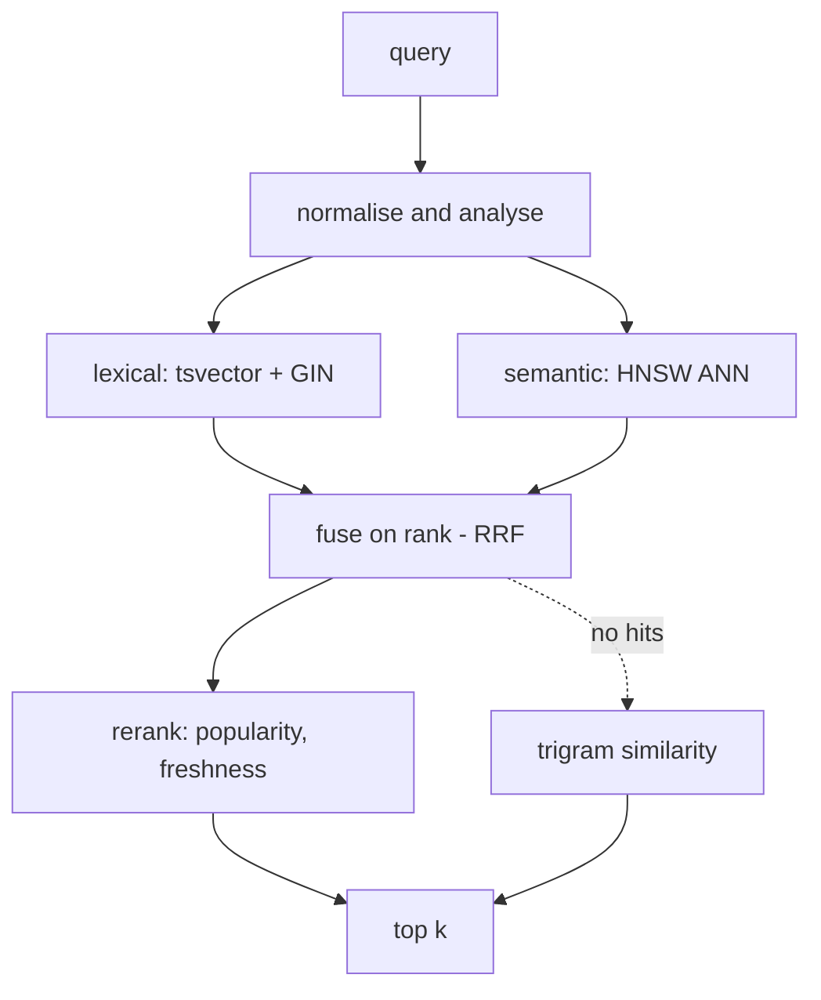

# search-relevance-lab

Four retrieval strategies over one PostgreSQL table, and a harness that says which one actually won.

My profile claims I am good at search. This is the version of that claim you can run.

## Run it

```bash
docker compose up --build      # Postgres + pgvector, schema, seed, API
npm run eval                   # the relevance table, ~1s

curl 'localhost:3000/search?q=tsvector&strategy=keyword'
curl 'localhost:3000/search?q=why+is+my+query+slow&strategy=hybrid'
curl 'localhost:3000/autocomplete?q=cach'
```

## The pipeline



## Four strategies, and what each one is bad at

The interesting column is the third one. Anything can look good on the query it was built for.

| Strategy | Index | Wins on | Loses on |
| --- | --- | --- | --- |
| `keyword` | GIN on `tsvector` | rare tokens, identifiers, error codes, SKUs | paraphrase, intent, anything the user did not spell out |
| `fuzzy` | GIN `gin_trgm_ops` | typos, transpositions, half-remembered names | precision, the moment you lower the threshold |
| `semantic` | HNSW, cosine | paraphrase, synonyms, vague intent | rare exact tokens it has never seen |
| `hybrid` | both, fused by rank | almost everything | latency budget, and explaining the result to a stakeholder |

## Lexical

The `tsvector` is a generated column, not trigger-maintained, so the index cannot drift from the row it describes. Weighting happens inside the index, which is why a title match outranks a body match without an application-side fudge factor.

```sql
tsv tsvector GENERATED ALWAYS AS (
    setweight(to_tsvector('english', coalesce(title, '')), 'A') ||
    setweight(to_tsvector('english', coalesce(body,  '')), 'B')
) STORED
```

Query side uses `websearch_to_tsquery`, not `plainto_tsquery`: it understands quoted phrases and leading-minus negation, and it does not throw when a human gets the syntax wrong. That last part matters when the input is a text box on the internet.

## Typos

```sql
WHERE d.title % $1                 -- the operator the GIN trigram index can serve
ORDER BY similarity(d.title, $1) DESC
```

The `%` is doing the work. Writing this as `ORDER BY similarity(...) DESC` with no `WHERE` returns the same rows and computes similarity for every row in the table first. Correct answers, sequential scan.

A leading wildcard is a different problem and not a solvable one: `LIKE '%term%'` has no prefix to seek on, so no B-tree can help it, ever. `LIKE 'term%'` is fine and is an index range scan under `text_pattern_ops`.

## Autocomplete

`LIKE 'pre%'` on an indexed column is already fast. What it is not is *ranked* -- you still sort every match by popularity, on every keystroke, and a hot prefix matches thousands of terms. So `src/trie.js` caches the best completions at every node: lookup walks the characters typed and then reads an already-sorted array.

The honest limitation, which is in the file too: that cache is only correct for hit counts that increase. A term evicted from a node's top-N cannot climb back without a rebuild. So seeds load in descending hit order and the trie rebuilds with the query-log rollup. It is a bounded staleness window I picked on purpose, not one I discovered in production.

## Semantic, and the mistake that costs you the index

```sql
SELECT 1 - (embedding <=> $1::vector) AS score   -- score for humans
FROM documents
ORDER BY embedding <=> $1::vector                -- ORDER BY on the raw operator
```

Order by the derived similarity instead and the planner can no longer match the `ORDER BY` to the HNSW operator class. The index is skipped, you get an exact scan, and the results are still perfectly correct -- which is exactly why this one survives code review.

**`src/embed.js` is not a semantic model.** It is feature hashing over unigrams and bigrams, L2-normalised into 384 dimensions. It exists so this repo clones and runs with no API key and no model download, and so the vector *plumbing* is real and testable end to end. It captures lexical overlap, not meaning: it will not put `car` near `automobile`. Swap the body of `embedText()` for a sentence transformer and nothing else in the repo changes. That seam is the point.

## Fusion

Reciprocal Rank Fusion, `1 / (k + rank)`, summed across legs, `k = 60` and deliberately untuned.

Why fuse on rank instead of normalising scores: `ts_rank_cd` and cosine similarity are not on a comparable scale and never will be. Min-max normalising them per query looks principled and is not -- one outlier moves every other score in the list. Ranks are already comparable.

Both legs over-fetch 3x before fusing, because a document ranked 40th lexically and 5th by vector is exactly the result hybrid retrieval exists to surface, and it is invisible if each leg only returns 20.

## How I know whether a change helped

`eval/queries.json` holds 12 queries with graded judgements, 3 down to 1, including a two-typo query and a query that should return nothing. `npm run eval` prints P@5, R@5, MRR and nDCG@5 per strategy.

nDCG is the one that earns its place: it is the only metric here that uses the grades. A 3 at rank 1 and a 1 at rank 1 are not the same outcome, and the other three cannot tell them apart.

**There are no numbers pasted into this README.** Anything I typed here you would have to take on faith, and the harness prints it on your machine in about a second. What I will commit to in advance is the falsifiable part -- the shape of the result:

- query 2 (`tsvector`): `keyword` should win outright and `semantic` should be near-useless. A single rare token is not a job for embeddings.
- query 5 (`postgre full text serach`): `keyword` should score ~0 and `fuzzy` should be the only leg that survives. This is what the fallback in `hybrid()` is for.
- query 10 (`vector similarity search`): `hybrid` should beat both of its own legs on nDCG, because both contribute real candidates.
- query 3 (`why is my query slow`): this is where semantic retrieval *should* win, and with the hashed stand-in embedder it probably will not. That prediction failing is the clearest measurement in the repo of what a real model buys you.

If you run it and the first three do not hold, I got something wrong and I would want to know.

## Tradeoffs

<details>
<summary><b>Why not Elasticsearch on day one?</b></summary>
<br/>
Because a second datastore is a second thing to keep consistent, secure, monitor, upgrade and pay for, and Postgres already does inverted indexes, trigrams and vectors well enough for a very long time. The move to a dedicated engine is worth it when you need analyzers per language, real BM25 tuning, aggregations over billions of documents, or read scaling independent of your primary. None of those were true for the systems I have owned. If they became true I would migrate, and the query set in <code>eval/</code> is what I would use to prove the migration did not quietly make relevance worse.
</details>

<details>
<summary><b>What breaks first if this corpus becomes 50 million rows?</b></summary>
<br/>
The trie, and I would delete it. It is in memory and it assumes the term set is small; at that scale autocomplete becomes a prefix scan on an indexed table with a materialised popularity rollup, or a dedicated suggester. Next is the HNSW build time and memory, which forces a partitioning or quantisation decision. The lexical path scales furthest -- GIN over tsvector is comfortable well past this point, though <code>ts_rank_cd</code> on a very common term starts to hurt because ranking has to touch every candidate, which is when you cap the candidate set before you rank it.
</details>

<details>
<summary><b>How do you stop popularity from burying everything new?</b></summary>
<br/>
Popularity is a ranking signal and never a filter. Used as a multiplier it guarantees that nothing new is ever discovered, because a document cannot become popular without first being shown. Bounded contribution, so it tilts a close call and cannot overturn a clear one, plus a freshness term with the same bound. Then measure it -- this is precisely the kind of change that improves the demo query and quietly costs you recall everywhere else, which is the whole reason <code>eval/</code> exists.
</details>

<details>
<summary><b>What is missing before this is production code?</b></summary>
<br/>
A real embedding model. Per-tenant filtering pushed into the index rather than applied after retrieval, which changes the HNSW story significantly. Query-log-driven judgements instead of my hand-graded ones, since my opinion of relevance is not the user's. Caching on the read path with an invalidation trigger, the same discipline as sub-200ms-stack. Tests around the fusion and the metric functions, which are pure and therefore cheap to test and easy to get subtly wrong.
</details>

## Layout

```
db/schema.sql      one table, three index strategies, commented
db/seed.js         20 documents with hand-graded relevance
src/search.js      keyword, fuzzy, semantic, hybrid, RRF, explain
src/trie.js        ranked prefix trie for the keystroke path
src/embed.js       the embedding seam, honestly labelled
src/server.js      HTTP surface, per-hop latency budgets
eval/queries.json  12 graded queries incl. typos and an empty case
eval/evaluate.js   P@k, R@k, MRR, nDCG@k
```

---

Companion repo: [**sub-200ms-stack**](https://github.com/ShanmukhaYenduri/sub-200ms-stack) -- the same discipline applied to latency instead of relevance. Both are linked from [my profile](https://github.com/ShanmukhaYenduri).
# search-relevance-lab
How I build search: PostgreSQL full-text (tsvector + GIN), trigram typo tolerance, a ranked prefix trie for autocomplete, and hybrid keyword + vector retrieval fused with RRF - plus an offline relevance harness so ranking changes are measured, not guessed.
